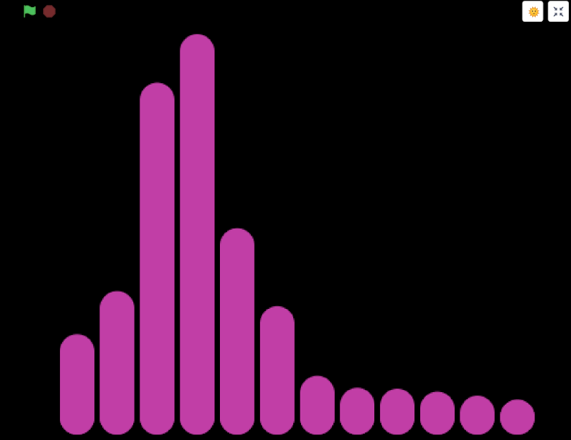

# **NeverlandSLE**

## **跟上那节奏！（Let's track the beat!）**

**使用 Python 获取音频信号并做 FFT 分析，使用 [CodeLab Adapter Linda](https://adapter.codelab.club/user_guide/Linda/) 发送数据，使用 Scratch 实时画图**

**Demo 视频[在此](video/livespectrum.mp4)，Scratch 代码[在此](https://create.codelab.club/projects/9478/)，python 代码[在此](AA_realtime_audiofft.ipynb)**

<!--
## **跟上那节奏！（Let's track the beat! ）**

这个根目录内的所有内容都始自对音乐 **节拍（beat）** 的分析，通过分析 beat，拿到时间序列，将灯光的开关、闪烁或颜色变化映射上去，与音乐形成呼应；或是在 Scratch 中作图，同理映射，做出视听协同的效果。这部分已做出一些 Demo，待整理。

当下还有几个方向待做：

+ 对音频信号更精细的分析，如区分不同频率、筛出重拍等

+ 对音频信号的实时分析（real-time），目前都还是预先分析本地音乐

+ 音乐服务器

+ 在 Scratch 中做视觉效果，再看看 python，或许也可以

+ 目前尝试过的智能灯（yeelight、philips、ws2812），似乎都很难准确跟上 librosa 生成的基础节拍时间序列，可以佛系跟或是间隔跟拍，之后可以再看看专业的舞台灯光

+ 以上这些看最后能不能整合到树莓派中

### **Demo 1: 我的 ❤️ 节奏**

已完成，具体见 [mybpm100.ipynb](./mybpm100.ipynb)，也支持在 binder 云服务器上[直接运行](https://mybinder.org/v2/gh/snownstone/tryagain/HEAD)。

## **关于网上如何示人**

基于 jupyterlab 本身的 Markdown 和 Pyhon code，转成 HTML 渲染，最终形式参考[这里](https://musicinformationretrieval.com/)，此目录内已生成 Demo 1 的 HTML。

眼看 Demo 1 装了如此多的依赖，他人复现可能会有各种问题，所以想把整个环境放在云上，他人可以直接运行并修改，有需要了再在本地操作。所以对 Demo 1 使用了 binder，但也有不少问题：

+ 对远程服务器的控制有限，很多东西实现起来很麻烦，只是 Demo 1 就花了非常大的力气（当然可能是因为陌生还有技术能力决定的）

+ 运行不稳定，中途会断掉与 kernel 的连接，且不能恢复

+ 没有测试是否需要翻墙使用，如需翻墙也会是问题

## 补充问题

+ 根目录内文件的归纳整理

-->